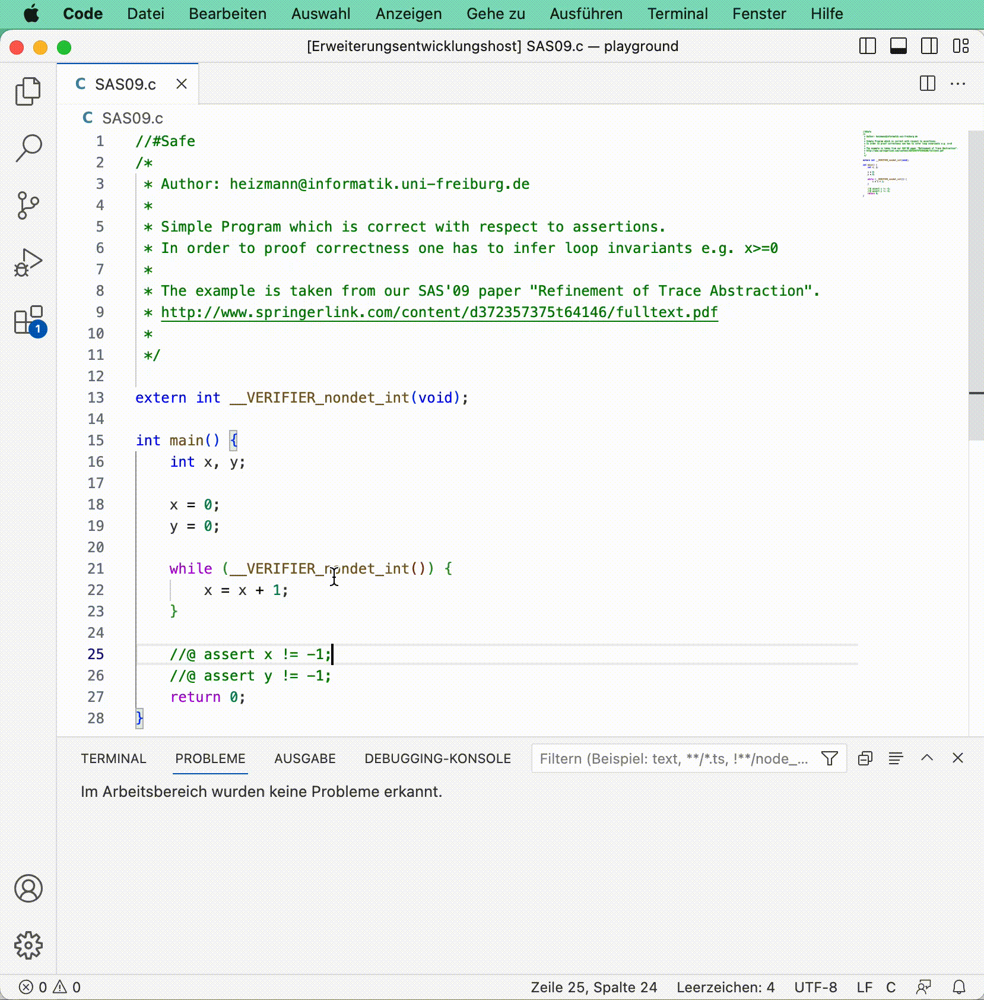

# Ultimate Automizer VS Code Extension

This extension runs a formal verification on the current active C file. It relies on [Ultimate Automizer](https://github.com/ultimate-pa/ultimate) as external tool.

## Features

After activation of this extension, on each saving of a C file, a formal verification by Ultimate Automizer on the file is performed.

## Requirements

Connection to a public server running Ultimate Automizer, e.g. https://monteverdi.informatik.uni-freiburg.de/ 

Alternatively a container providing the API can be executed inside Docker.

## Extension Settings

This extension contributes the following settings:

* `ultimate.mode`: `"REST API"`/`"stdout"` to specify if Ultimate will be accessed by accessing a REST API or the output of the command line.
* `ultimate.url`: Base URL of the REST API endpoint.
* `ultimate.executablePath`: Path to the executable of Ultimate is NOT accessed by the REST API. This can either be Ultimate itself or the [wrapper script for MacOS](https://github.com/FahrJo/ultimate-automizer-docker).
* `ultimate.settingsPath`: Path to the settings (*.epl) of Ultimate is not accessed by the REST API.
* `ultimate.toolchainPath`: Path to the toolchain (*.xml) of Ultimate is NOT accessed by the REST API.

<!--## Known Issues

Calling out known issues can help limit users opening duplicate issues against your extension.

## Release Notes

Users appreciate release notes as you update your extension.

### 1.0.0

Initial release of ...

### 1.0.1

Fixed issue #.

### 1.1.0

Added features X, Y, and Z.

---
-->
